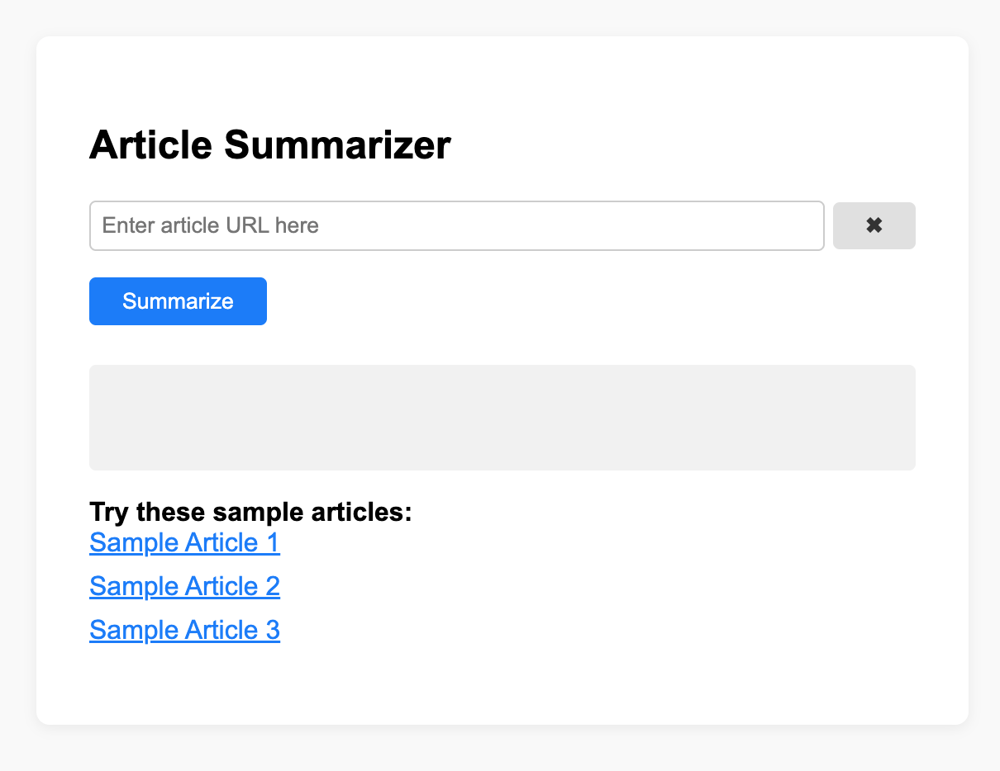
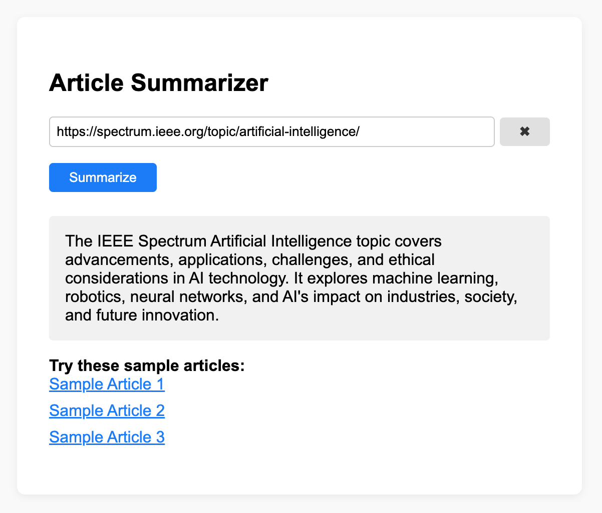

# Article Summary Node.js Project

## Setup
1. Copy `.env` to your own values. OPENAI_API_KEY is mandatory.
2. Run `npm install` to install dependencies
3. Start the server: `node index.js`

## Environment Variables
- `PORT`: Port for the server (default: 3000)
- `MESSAGE`: Message to display
- `OPENAI_API_KEY`: Open AI Api key

## Description
This project is a Node.js web application that summarizes news articles using OpenAI's API. Users can enter or select an article URL on the web interface, and the app generates a concise summary (under 60 words) for the provided article. The project uses Express for the backend, EJS for rendering the frontend, and dotenv for environment variable management. It is ready for local development and deployment, with support for custom environment variables and a user-friendly UI.

